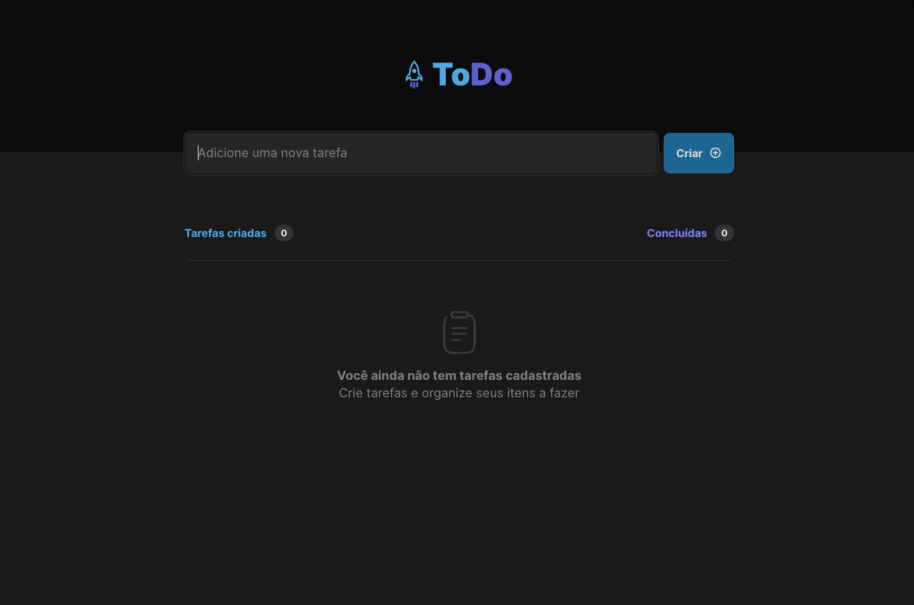

# ToDo List 

Projeto desenvolvido como desafio do primeiro módulo do curso Ignite da Rocketseat.  
> Para ver o projeto rodando você pode acessar este [Link](https://desafio-01-to-do-list-ten.vercel.app/).

---

Aplicação WEB:

  

---
## Funcionalidades

- [x] Adicionar uma nova tarefa
- [x] Marcar e desmarcar uma tarefa como concluída
- [x] Remover uma tarefa da lista
- [x] Mostrar o progresso de conclusão de tarefas

---

## Tecnologias

- [`React`](https://pt-br.reactjs.org/)
- [`Typescript`](https://www.typescriptlang.org/docs/)
- [`CSS Modules`](https://github.com/css-modules/css-modules)